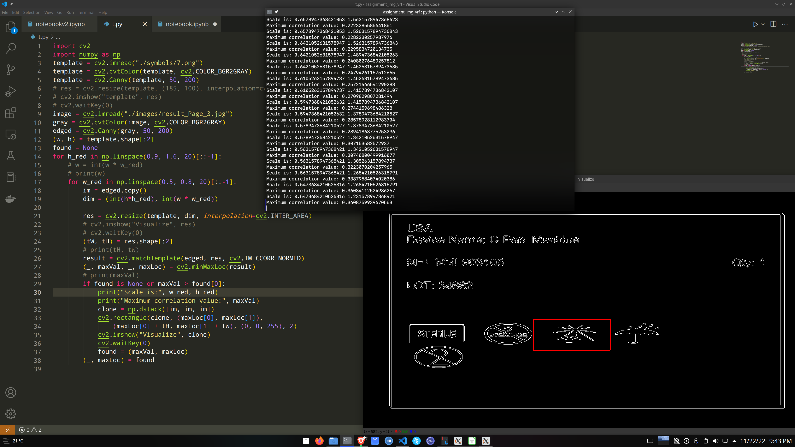

# Extract Information from device labels using Multi-Scale Template Matching

The objective of this project is to extract details from images of medical device labels and store them in a spreadsheet file. The provided dataset consists of 7 images and a document file of 9 repeated entities of
medical device labels. Also, we are provided with 9 images of symbols that generally occur in the provided labels with proper number identification.
## Approach
The device labels images contains two kinds of information to be extracted from it. The first kind is the text like the device name, lot no., quantity and so on. The second kind is the number identifier of the various symbols that are present in each label. For the first part of the problem we use optical character recognition through the open- source Tesseract-OCR engine. The second part of the problem is solved using multi-scale template matching algorithm which is implemented using the popular computer vision framework OpenCV. The entire process is explained in the following sub-sections.

## Multi-Scale Template Matching
The symbols in the device labels appear out of proportions compared to the versions that are provided in the symbols folder. Since, template matching expects both the template and the instance of the template in the image to be of the same size, the traditional template matching algorithm fails to deliver optimal results. Therefore, to tackle the problem, we use multi-scale template matching in which the template is first resized
and then it is slid over the entire image to compute the correlation between different regions of the image and the resized version of the template. The region with the highest correlation is more likely to contain the template pattern. The process is repeated for multiple resized versions of the template to obtain the highest correlation value. The entire process is as follows:
- Convert the image to grayscale and detect the edges present in the image using Canny edge detector.
- Detect edges on the template image and choose scaling factors for the height and width of the template image in each iteration.
- Iterate over the different scaling factors and find the new size of the template by multiplying the scaling factors with dimensions of the template image and then resize the template image to the new size in each iteration.
